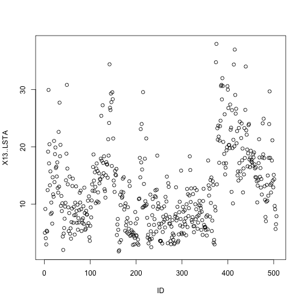

##This doccument is the result of a Survey among 506 respondent
 This dataset was taken from the StatLib library which is
maintained at Carnegie Mellon University
<br>Number of Instances: 506                
<br>   Number of Attributes: 13 continuous attributes (including "class"
attribute "MEDV"), 1 binary-valued attribute 

<br> 1. CRIM      per capita crime rate by town
    2. ZN        proportion of residential land zoned for lots over 
                 25,000 sq.ft.
    3. INDUS     proportion of non-retail business acres per town
    4. CHAS      Charles River dummy variable (= 1 if tract bounds 
                 river; 0 otherwise)
    5. NOX       nitric oxides concentration (parts per 10 million)
    6. RM        average number of rooms per dwelling
    7. AGE       proportion of owner-occupied units built prior to 1940
    8. DIS       weighted distances to five Boston employment centres
    9. RAD       index of accessibility to radial highways
    10. TAX      full-value property-tax rate per $10,000
    11. PTRATIO  pupil-teacher ratio by town
    12. B        1000(Bk - 0.63)^2 where Bk is the proportion of blacks 
                 by town
    13. LSTAT    % lower status of the population
    14. MEDV     Median value of owner-occupied homes in $1000's
    
    
    Target variable to predict: pricing of house MEDIAN

```r
myData <- read.csv(file = "DATA/housing.data.csv", header = TRUE, sep=";")

View(myData, header=FALSE)
```

```
## Error in View(myData, header = FALSE): unused argument (header = FALSE)
```

```r
Price_of_Houses <- myData[,14]
ID<-c(1:506)
MyDataID <-cbind(ID,myData)
plot(MyDataID[,c(1,14)])
```



```r
summary(MyDataID[,14])
```

```
##    Min. 1st Qu.  Median    Mean 3rd Qu.    Max. 
##    1.73    6.95   11.36   12.65   16.96   37.97
```


####Questions

<br>1.What are the main factors that influence the price of house in Boston?
<br>2.Which are the main cluster of houses that can be identify?
<br>3.What is the best prediction of the relative importance of those factors?


## Step 1: Confirm data is metric


```
##  [1] "ID"        "X1..CRIM"  "X2..ZN"    "X3..INDUS" "X4..CHAS" 
##  [6] "X5..NOX"   "X6..RM"    "X7..AGE"   "X8..DIS"   "X9..RAD"  
## [11] "X10..TAX"  "X11..PTRA" "X12..B"    "X13..LSTA" "X14..MEDV"
```

## Step 1: Confirm data is metric


```r
knitr::kable(round(my_summary(ProjectDataFactor), 2))
```


|          |    min| 25 percent| median|   mean| 75 percent|    max|    std|
|:---------|------:|----------:|------:|------:|----------:|------:|------:|
|ID        |   1.00|     127.25| 253.50| 253.50|     379.75| 506.00| 146.21|
|X1..CRIM  |   1.00|     126.25| 252.50| 252.22|     377.75| 504.00| 145.81|
|X2..ZN    |   0.00|       0.00|   0.00|  11.36|      12.50| 100.00|  23.32|
|X3..INDUS |   0.46|       5.19|   9.69|  11.14|      18.10|  27.74|   6.86|
|X4..CHAS  |   0.00|       0.00|   0.00|   0.07|       0.00|   1.00|   0.25|
|X5..NOX   |   0.38|       0.45|   0.54|   0.55|       0.62|   0.87|   0.12|
|X6..RM    |  35.61|      58.86|  62.09|  62.85|      66.23|  87.80|   7.03|
|X7..AGE   |   2.90|      45.02|  77.50|  68.57|      94.07| 100.00|  28.15|
|X8..DIS   |  11.30|      21.00|  32.07|  37.95|      51.88| 121.27|  21.06|
|X9..RAD   |   1.00|       4.00|   5.00|   9.55|      24.00|  24.00|   8.71|
|X10..TAX  | 187.00|     279.00| 330.00| 408.24|     666.00| 711.00| 168.54|
|X11..PTRA |  12.60|      17.40|  19.05|  18.46|      20.20|  22.00|   2.16|
|X12..B    |   0.32|     375.38| 391.44| 356.67|     396.23| 396.90|  91.29|
|X13..LSTA |   1.73|       6.95|  11.36|  12.65|      16.96|  37.97|   7.14|
|X14..MEDV |   5.00|      17.02|  21.20|  22.53|      25.00|  50.00|   9.20|
## Step 2: Scale the  data

```r
ProjectDatafactor_scaled = apply(ProjectDataFactor, 2, function(r) {
    if (sd(r) != 0) 
        res = (r - mean(r))/sd(r) else res = 0 * r
    res
})
```
Notice now the summary statistics of the scaled dataset:


```r
knitr::kable(round(my_summary(ProjectDatafactor_scaled), 2))
```


|          |   min| 25 percent| median| mean| 75 percent|  max| std|
|:---------|-----:|----------:|------:|----:|----------:|----:|---:|
|ID        | -1.73|      -0.86|   0.00|    0|       0.86| 1.73|   1|
|X1..CRIM  | -1.72|      -0.86|   0.00|    0|       0.86| 1.73|   1|
|X2..ZN    | -0.49|      -0.49|  -0.49|    0|       0.05| 3.80|   1|
|X3..INDUS | -1.56|      -0.87|  -0.21|    0|       1.01| 2.42|   1|
|X4..CHAS  | -0.27|      -0.27|  -0.27|    0|      -0.27| 3.66|   1|
|X5..NOX   | -1.46|      -0.91|  -0.14|    0|       0.60| 2.73|   1|
|X6..RM    | -3.88|      -0.57|  -0.11|    0|       0.48| 3.55|   1|
|X7..AGE   | -2.33|      -0.84|   0.32|    0|       0.91| 1.12|   1|
|X8..DIS   | -1.27|      -0.80|  -0.28|    0|       0.66| 3.96|   1|
|X9..RAD   | -0.98|      -0.64|  -0.52|    0|       1.66| 1.66|   1|
|X10..TAX  | -1.31|      -0.77|  -0.46|    0|       1.53| 1.80|   1|
|X11..PTRA | -2.70|      -0.49|   0.27|    0|       0.81| 1.64|   1|
|X12..B    | -3.90|       0.20|   0.38|    0|       0.43| 0.44|   1|
|X13..LSTA | -1.53|      -0.80|  -0.18|    0|       0.60| 3.55|   1|
|X14..MEDV | -1.91|      -0.60|  -0.14|    0|       0.27| 2.99|   1|

## Step 3:  Check correlations 
Check for correlation


```r
thecor = round(cor(ProjectDataFactor),2)
colnames(thecor)<-colnames(ProjectDataFactor)
rownames(thecor)<-colnames(ProjectDataFactor)

knitr::kable(round(thecor,2))
```


|          |    ID| X1..CRIM| X2..ZN| X3..INDUS| X4..CHAS| X5..NOX| X6..RM| X7..AGE| X8..DIS| X9..RAD| X10..TAX| X11..PTRA| X12..B| X13..LSTA| X14..MEDV|
|:---------|-----:|--------:|------:|---------:|--------:|-------:|------:|-------:|-------:|-------:|--------:|---------:|------:|---------:|---------:|
|ID        |  1.00|     0.42|  -0.10|      0.40|     0.00|    0.40|  -0.08|    0.20|   -0.30|    0.69|     0.67|      0.29|  -0.30|      0.26|     -0.23|
|X1..CRIM  |  0.42|     1.00|  -0.56|      0.72|     0.08|    0.79|  -0.27|    0.66|   -0.67|    0.74|     0.73|      0.34|  -0.38|      0.55|     -0.38|
|X2..ZN    | -0.10|    -0.56|   1.00|     -0.53|    -0.04|   -0.52|   0.31|   -0.57|    0.66|   -0.31|    -0.31|     -0.39|   0.18|     -0.41|      0.36|
|X3..INDUS |  0.40|     0.72|  -0.53|      1.00|     0.06|    0.76|  -0.39|    0.64|   -0.71|    0.60|     0.72|      0.38|  -0.36|      0.60|     -0.48|
|X4..CHAS  |  0.00|     0.08|  -0.04|      0.06|     1.00|    0.09|   0.09|    0.09|   -0.10|   -0.01|    -0.04|     -0.12|   0.05|     -0.05|      0.18|
|X5..NOX   |  0.40|     0.79|  -0.52|      0.76|     0.09|    1.00|  -0.30|    0.73|   -0.77|    0.61|     0.67|      0.19|  -0.38|      0.59|     -0.43|
|X6..RM    | -0.08|    -0.27|   0.31|     -0.39|     0.09|   -0.30|   1.00|   -0.24|    0.21|   -0.21|    -0.29|     -0.36|   0.13|     -0.61|      0.70|
|X7..AGE   |  0.20|     0.66|  -0.57|      0.64|     0.09|    0.73|  -0.24|    1.00|   -0.75|    0.46|     0.51|      0.26|  -0.27|      0.60|     -0.38|
|X8..DIS   | -0.30|    -0.67|   0.66|     -0.71|    -0.10|   -0.77|   0.21|   -0.75|    1.00|   -0.49|    -0.53|     -0.23|   0.29|     -0.50|      0.25|
|X9..RAD   |  0.69|     0.74|  -0.31|      0.60|    -0.01|    0.61|  -0.21|    0.46|   -0.49|    1.00|     0.91|      0.46|  -0.44|      0.49|     -0.38|
|X10..TAX  |  0.67|     0.73|  -0.31|      0.72|    -0.04|    0.67|  -0.29|    0.51|   -0.53|    0.91|     1.00|      0.46|  -0.44|      0.54|     -0.47|
|X11..PTRA |  0.29|     0.34|  -0.39|      0.38|    -0.12|    0.19|  -0.36|    0.26|   -0.23|    0.46|     0.46|      1.00|  -0.18|      0.37|     -0.51|
|X12..B    | -0.30|    -0.38|   0.18|     -0.36|     0.05|   -0.38|   0.13|   -0.27|    0.29|   -0.44|    -0.44|     -0.18|   1.00|     -0.37|      0.33|
|X13..LSTA |  0.26|     0.55|  -0.41|      0.60|    -0.05|    0.59|  -0.61|    0.60|   -0.50|    0.49|     0.54|      0.37|  -0.37|      1.00|     -0.74|
|X14..MEDV | -0.23|    -0.38|   0.36|     -0.48|     0.18|   -0.43|   0.70|   -0.38|    0.25|   -0.38|    -0.47|     -0.51|   0.33|     -0.74|      1.00|
